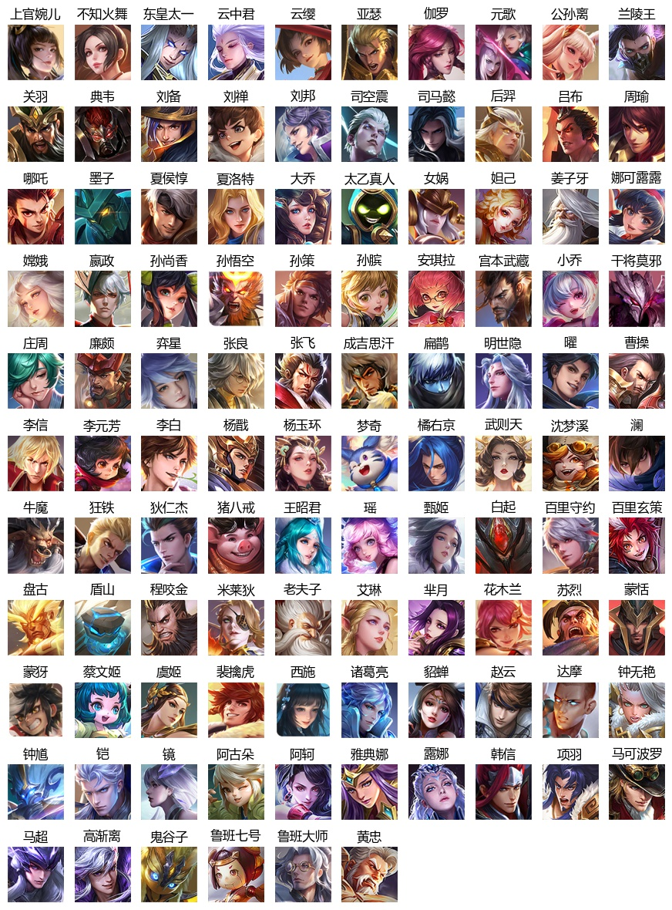

# Introduction
Downloading heros' images from [pvp.qq.com](https://pvp.qq.com/) based on Muti-thread.
# Demo

# Install
```bash
pip install -r requirements.txt
```
# Usage
```bash
git clone https://github.com/XavierJiezou/pvp-heros-img.git
cd pvp-heros-img
python main.py
```
# Build
```bash
pipenv install
pipenv shell
pip install -r requirements.txt
pip install pyinstaller
pyinstaller -F -i favicon.ico main.py
pipenv --rm
```
# Realease
- [Herodown-win64-1.0.0.exe](https://github.com/XavierJiezou/python-crawl-learning/releases/download/1.0.0/Herodown-win64-1.0.0.exe)
